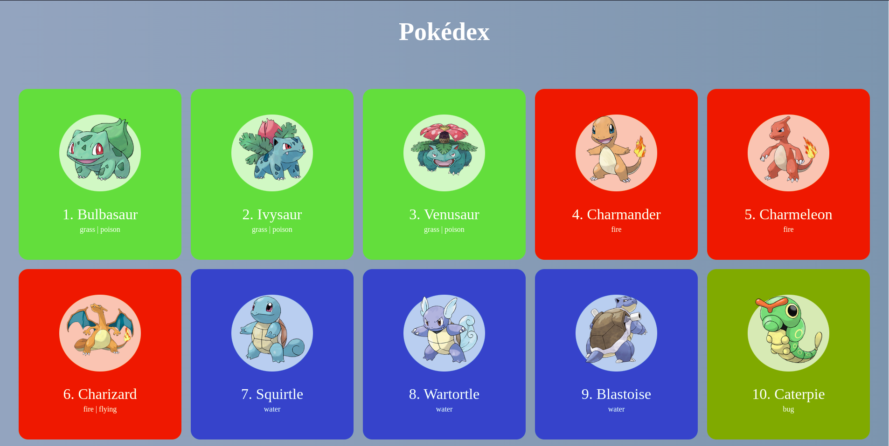

# Pokédex


Esse projeto simula uma pokédex dos jogos clássicos de GameBoy: Pokémon Red, Pokémon Blue e Pokémon Yellow. Seu objetivo é buscar informações dos primeiros 151 pokémon em uma API e exibir essas informações na tela.



---

## :file_folder: Acesso ao projeto
Você pode clonar esse repositório usando o comando a seguir:

```bash
git clone git@github.com:FabioAdrianoSilveira/pokedex.git
```

---

## :open_file_folder: Abrir e rodar o projeto localmente
Para rodar esse projeto basta abrir o arquivo **index.html** com o navegador de sua preferência

---

## :hammer_and_wrench: Ferramentas e tecnologias
* HTML
* CSS
* JavaScript

---

## :star: Créditos e inspirações

* O HTML e o CSS desse projeto são baseados [nesse repositório](https://github.com/Roger-Melo/pokedex)
* As informações dos pokémon são tiradas da [PokéAPI](https://pokeapi.co/)
* Os sprites dos pokémon são tirados [desse repositório](https://github.com/RafaelSilva2k22/PokemonImages)

---

## :bust_in_silhouette: Autor do projeto

[<br><sub>Fábio Adriano Silveira</sub>](https://github.com/FabioAdrianoSilveira)
